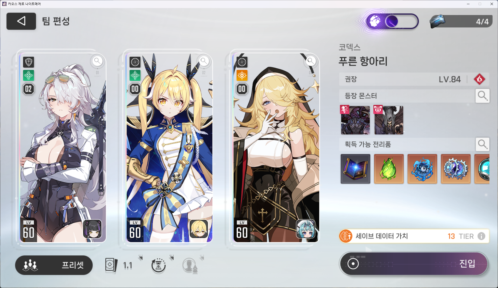
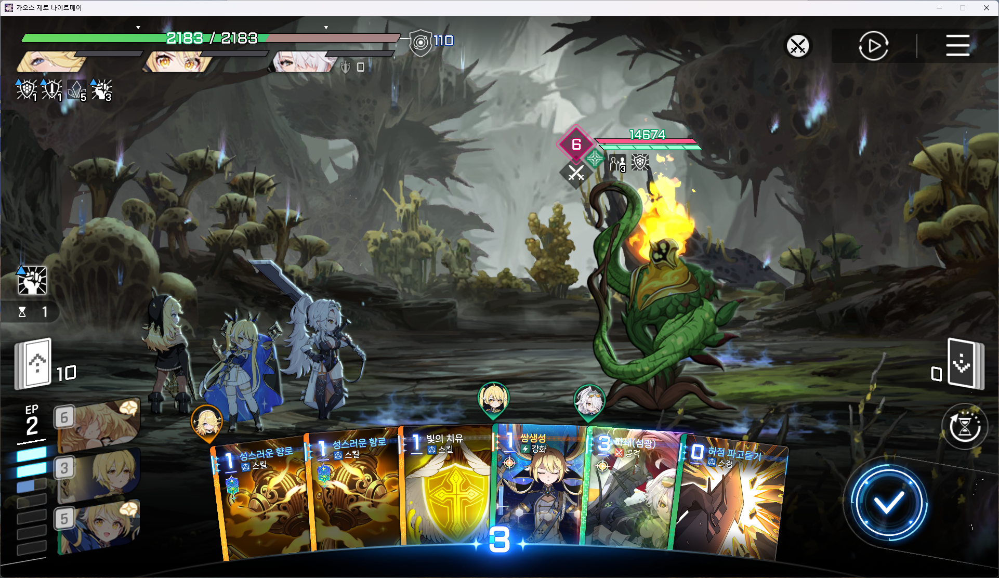
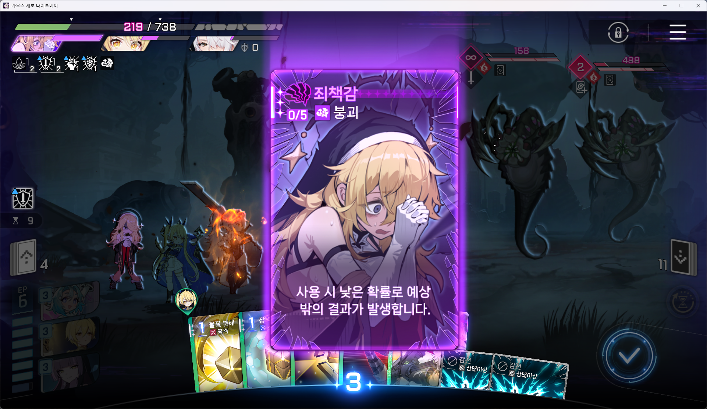
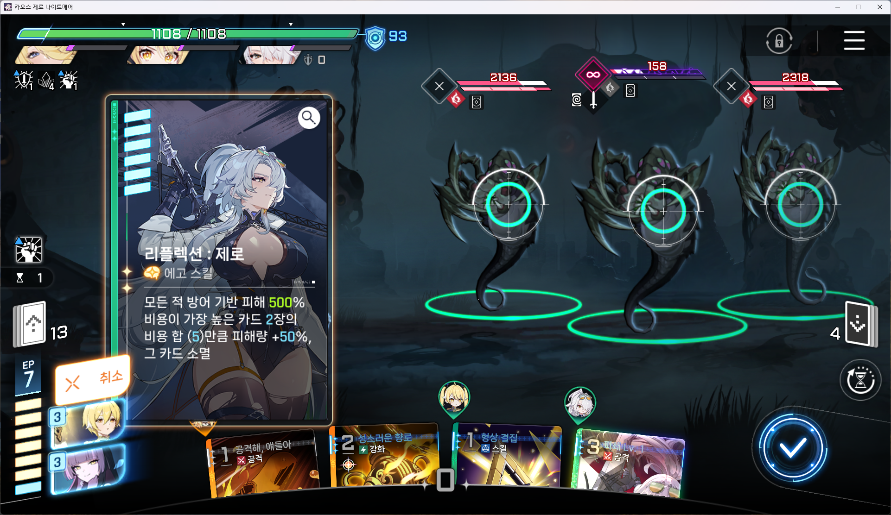
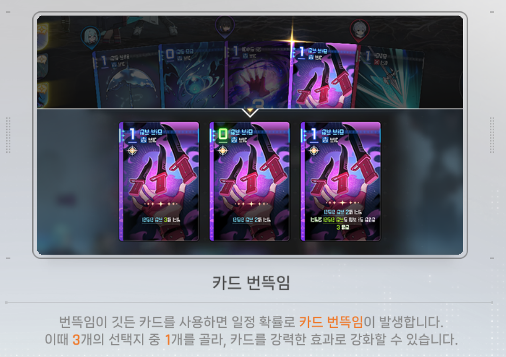
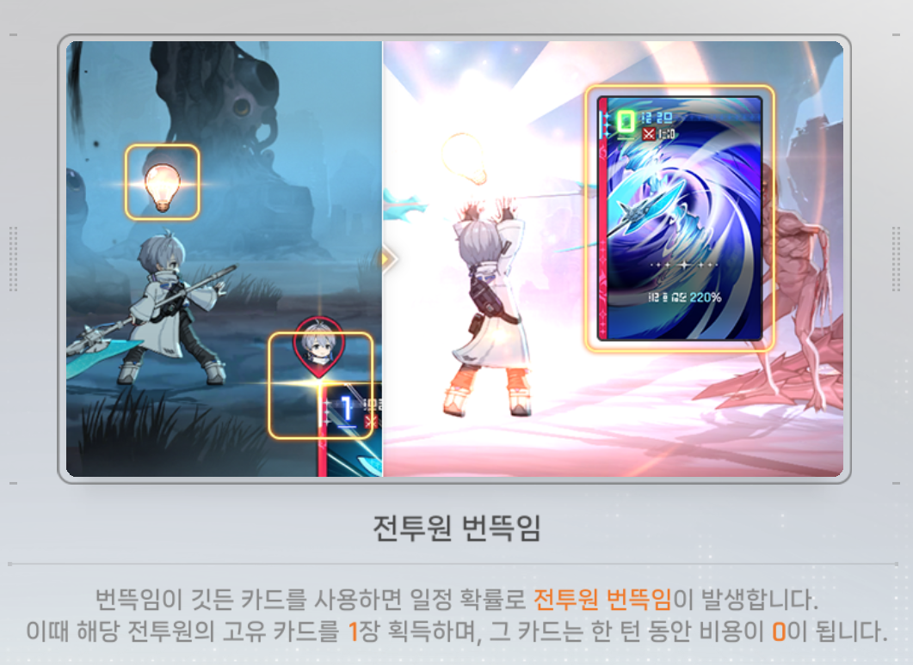
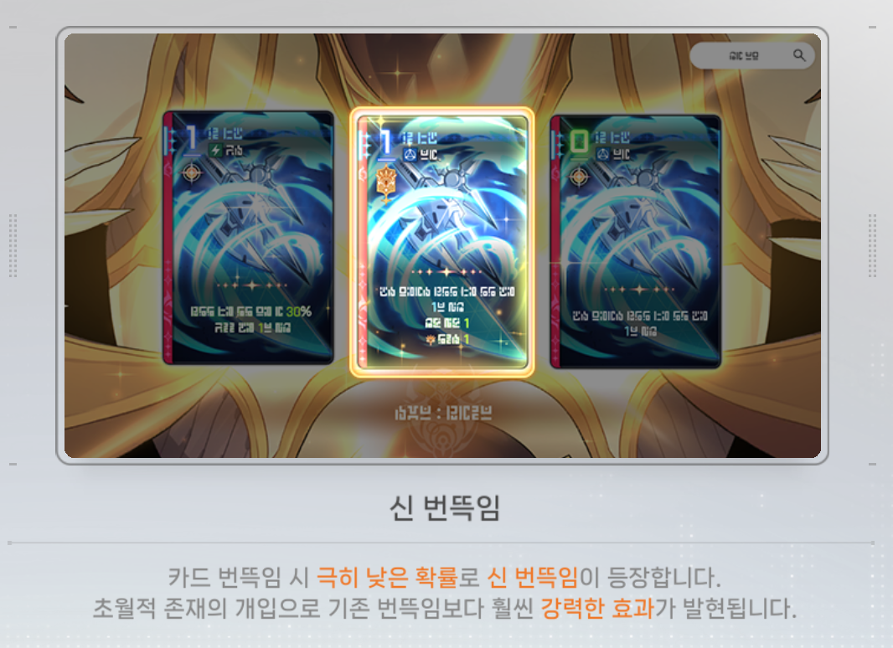

<!-- _class: lead -->
<!-- _paginate: false -->

# 카오스 제로 나이트메어
## 전투 매커니즘 분석서

**김우성** | QA 7년차
2026.03

---

# 섹션 1 — 분석 목적 & 범위

게임 전투 시스템의 **구조적 이해**를 바탕으로 효과적인 QA 전략 수립 및 밸런스 검증 수행

### 분석 대상

| 구분 | 수치 |
|------|------|
| 캐릭터 | **28명** (5성 17 / 4성 11) |
| 카드 | **882장** — 기본 61 + 고유 139 + 번뜩임 560 + 중립 94 + 몬스터 28 |
| 카드 타입 | **3종** (공격 369 / 스킬 366 / 강화 145) |
| 카드 태그 | **18종 이상** (분석 대상 **6종**) · 효과 타입 **3종** (피해 / 실드 / 치유) |

---

# 핵심 시스템 개요

| 시스템 | 요약 |
|--------|------|
| 턴 자원 | 행동 포인트 **3** / 턴, 드로우 **5장**, 핸드 최대 **10장** |
| 강인도 / 격파 | 일부 몬스터 보유 — 코스트 기반 강인도 피해, 약점·타게팅 시 증가 → 0 도달 시 격파 |
| 스트레스 / 붕괴 | 개인별 **0~100** 게이지 → 100 도달 시 붕괴(전투불능) |
| 링크 크래시 | **HP 0** 또는 **전원 붕괴** → 회복 불능, 피격 시 즉시 패배 |
| 에고 스킬 | EP 공유 풀 — 전투원·파트너 공용 **6종** |
| 퍼스트 스킬 | 시간의 모래 기반 — 함장 전용 **4종** |
| 데미지 연산 | 합연산(+X%) vs 곱연산(증가) — **스탯 보정 후 최종 배율 적용** |
| 덱 빌딩 | 고정 풀 + 중립 + 몬스터 + 번뜩임 3종 + 카오스 세이브 |

---

<!-- _class: lead -->

# 섹션 2
## 전투 기본 구조

**파티 → 턴 흐름 → 행동 포인트 → 카드 시스템**
전투의 뼈대를 이루는 기본 구조와 자원 관리

---

<style scoped>
section { padding: 40px 60px 40px 40px; }
</style>

# 파티 구성



**전투원 3명** — 전투의 주체
- 각 전투원의 기본+고유 카드가 **덱 풀**을 구성
- 에고 스킬 보유 (EP 공유 풀에서 소모)

**파트너** — 장비(전용 무기) 개념
- 전투원에 장착, 에고 스킬 제공 (EP 공유)
- **체력** = 전투원 + 파트너 HP 합산

**퍼스트(함장)** — 전장 외 지원
- 시간의 모래 기반 퍼스트 스킬
- 턴 초기화·되돌리기

> 편성 = **컨셉 설정**(카드 풀 결정), 실제 전략은 **세이브 데이터**로 완성


---

# 전투 시스템 아키텍처 (턴 흐름)

<div class="flow">
  <div class="step">턴 시작 — 행동 포인트 3 할당 + 5장 드로우 (첫 턴: 개전 카드 보장)</div>
  <div class="arr">▼</div>
  <div class="process">
    <em>카드 선택 & 사용</em><br/>
    행동 포인트 소비 → 효과 해소 → 태그 발동 · 에고(EP) / 퍼스트(모래)<br/>
    공격 → 강인도↓(약점 시 효과↑) → 격파 · 적 처치 → 행동 포인트 +1
  </div>
  <div class="arr">▼</div>
  <div class="cards">
    <div class="c atk"><em>공격 369장</em><span>직접 피해</span></div>
    <div class="c skl"><em>스킬 366장</em><span>실드 / 치유</span></div>
    <div class="c upg"><em>강화 145장</em><span>버프 / 변환</span></div>
    <div class="c crs"><em>중립+몬스터 122장</em><span>공용 보강</span></div>
  </div>
  <div class="arr">▼</div>
  <div class="alert">피격 → 스트레스 변동 (HP > 실드) → 스트레스 100 = 붕괴 → 카드 대체</div>
  <div class="arr">▼</div>
  <div class="step">턴 종료 — 비보존 카드 → 무덤 / 소진 시 무덤 → 덱 순환</div>
</div>

---

# 행동 포인트 시스템 & 자원 관리

턴당 **행동 포인트 3** 할당, **5장 드로우** (최대 10장 핸드) — 카드 사용의 전략적 자원 관리 시스템

### 기본 규칙

- 턴 시작: 행동 포인트 3 회복 + 카드 5장 드로우
- **적 처치 시**: 행동 포인트 **+1 회복** + 적 행동 카운트 +1 + 스트레스 감소
- 핸드 상한 **10장** — 보존 태그 카드 축적 시 드로우 제한 가능

### 행동 포인트 코스트별 카드 분포 (전체 882장)

| 행동 포인트 | 카드 수 | 비율 | 구성 |
|----|---------|------|------|
| 0 | 129장 | 14.6% | 스킬 90, 공격 22, 강화 17 |
| 1 | 571장 | 64.7% | 스킬 244, 공격 218, 강화 107 |
| 2 | 141장 | 16.0% | 공격 94, 스킬 27, 강화 20 |
| 3+ | 41장 | 4.6% | 공격 35, 스킬 5, 강화 1 |

---

<!-- _class: annotated -->

### 전투 UI — 핵심 게이지



<div class="co" style="top:1%; left:20%"><span class="n">A</span><span class="l"><em>HP 2183</em> — 파티 공유 총 체력</span></div>
<div class="co" style="top:20%; left:1%"><span class="n">B</span><span class="l"><em>스트레스</em> 게이지 (보라색)</span></div>
<div class="co" style="top:65%; left:1%"><span class="n">C</span><span class="l"><em>행동 포인트 10</em> — 잔여 행동 포인트</span></div>
<div class="co" style="top:68%; left:28%"><span class="n">D</span><span class="l"><em>카드 핸드</em> — 행동 포인트 코스트 표시</span></div>
<div class="co" style="top:12%; left:62%"><span class="n">E</span><span class="l"><em>적</em> 체력/<em>강인도</em> — 0 도달 시 격파</span></div>


---

# 카드 시스템 개요

### 카드 타입별 분포 (882장 = 기본 61 + 고유 139 + 번뜩임 560 + 중립 94 + 몬스터 28)

| 타입 | 기본 | 고유 | 번뜩임 | 중립 | 몬스터 | **합계** |
|------|------|------|--------|------|--------|----------|
| **공격** | 32 | 68 | 220 | 37 | 12 | **369** (42%) |
| **스킬** | 29 | 52 | 227 | 47 | 11 | **366** (42%) |
| **강화** | — | 19 | 113 | 8 | 5 | **145** (16%) |
| **저주/상태** | — | — | — | 2 | — | 가변 (덱 오염) |

---

# 카드 카테고리 (882장)

| 구분 | 기본 | 고유 | 번뜩임 | 중립 | 몬스터 |
|------|------|------|--------|------|--------|
| 카드 수 | 61장 | 139장 | 560장 | 94장 | 28장 |
| 공격 | 32 | 68 | 220 | 37 | 12 |
| 스킬 | 29 | 52 | 227 | 47 | 11 |
| 강화 | — | 19 | 113 | 8 | 5 |
| 특징 | 안정적 기반 | **강화 독점** + 태그 집중 | **역할 전환** 84건 | 공용 보강 (시즌 26장 포함) | 전투 드롭 |

### 핵심 설계 원칙

- **기본 카드**: 캐릭터당 2~3장 — 안정적 기반
- **고유 카드**: 캐릭터당 4~6장 — **전략적 선택지** 제공
- **번뜩임**: 고유 카드 × 5종 바리에이션 — 타입 전환 84건 (공격↔스킬↔강화)
- **덱 순환(셔플)**: 뽑을 카드 소진 → 버린 카드 더미를 섞어 뽑을 카드에 추가. 단, **턴 중 사용한 카드는 셔플에 미포함** — 같은 턴 재사용 불가
- **저주/상태 카드**는 덱을 오염시켜 핸드 효율↓ — 상점 제거(저주) / 전투 종료(상태)로 해소

---

# 효과 타입 분류

기본+고유 공격/스킬 카드 **181장** 기준 (강화 19장 + 저주/상태는 직접 수치 효과 없음)

| 효과 | 카드 수 | 비율 | 값 범위 | 역할 |
|------|---------|------|---------|------|
| **피해** | 105장 | 64.0% | 30~450% | 직접 피해 — 전투의 핵심 |
| **실드** | 44장 | 26.8% | 20~350% | 보호막 — 생존 수단 |
| **치유** | 15장 | 9.1% | 20~200% | 회복 — 희소 자원 |

### 다단 히트 카드 (8장)

| 카드 | 히트 | 총 배율 | 캐릭터 | 비고 |
|------|------|---------|--------|------|
| **코발트 라이트** | 180% × 4 | **720%** | 세레니엘 | AP3, 최고 총 배율 |
| **급소 공격** | 150% × 3 | **450%** | 트레사 | AP2 |
| 칠흑의 송시 | 50% × 3 | 150% | 레노아 | |
| 도깨비 사냥 | 60% × 3 | 180% | 치즈루 | 신속 |
| 단검 방사 | 60% × 3 | 180% | 휴고 | 신속 |
| 빠른 해결법 | 80% × 2 | 160% | 휴고 | 신속 |
| 연속 격발 | 50% × 2 | 100% | 루크 | |
| 메탈 피어스 | 90% × 2 | 180% | 아미르 | |

---

<!-- _class: lead -->

# 섹션 3
## 데미지 시스템

**공식 → 연산 규칙 → 스탯 파이프라인**

---

# 데미지 공식

### ATK 기반 (일반 캐릭터)

```
최종 피해 = CardMultiplier × ATK × 0.35 × modifiers
```

**예시**: 레노아 (ATK 492) — 피해 140% 카드
`1.40 × 492 × 0.35 = 241.1`

### DEF 기반 (7캐릭터)

```
최종 피해 = CardMultiplier × ((ATK × 0.3) + (DEF × 2.1)) × 0.35
```

| 캐릭터 | 클래스 | DEF 기반 카드 수 | 대표 카드 |
|--------|--------|-----------------|----------|
| **나인** | Vanguard | 전체 | 파쇄, 참격, 노련한 일격, 치명적 일격 |
| **칼리페** | Vanguard | 전체 | 벌쳐 사출, 대검 아퀼라 |
| **나르자** | Striker | 일부 | 굶주림의 굴레, 탐식의 영역 |
| **마그나** | Vanguard | 대부분 | 빙결의 주먹, 빙하의 철권 |
| **티페라** | Controller | 일부 | 창조와 파괴 |
| **아미르** | Vanguard | 전체 | 레이피어, 메탈 피어스, 풀 메탈 허리케인 |
| **마리벨** | Vanguard | 전체 | 셸터 킥, 의지의 돌진, 마리벨 셸터 MK.II |

**예시**: 나인 (ATK 407, DEF 178) — 피해 100% 카드
`1.00 × ((407 × 0.3) + (178 × 2.1)) × 0.35 = 1.00 × (122.1 + 373.8) × 0.35 = 173.6`

> **패턴**: Vanguard 클래스 5명 중 5명 전원이 DEF 기반 — 클래스 특성으로 고정

---

# 합연산 vs 곱연산 — 증가 표기 규칙

| 표기 | 연산 방식 | 예시 (300% 카드) |
|------|----------|-----------------|
| **"30% 증가"** (부호 없음) | **곱연산** (base × 1.3) | 300% × 1.3 = **390%** |
| **"+30%"** (부호 있음) | **합연산** (base + flat) | 300% + 30% = **330%** |

- "증가"만 있으면 곱연산 → 기존 배율에 **곱해지는** 구조 (강화 효과 주로 사용)
- "+X%" 부호가 있으면 합연산 → 기존 배율에 **더해지는** 구조
- 복수 버프 중첩 시 **연산 순서**에 따라 최종 피해 크게 변동


### 크리티컬 기대값 보정

```
기대 배율 = 1 + (CC/100) × ((150 + CD)/100 - 1)
```

기본 CC=10%, CD=12% → `1 + 0.10 × (1.62 - 1) = 1.062` (+6.2%)

---

# 능력치 적용 파이프라인

데미지 공식의 ATK/DEF 값은 **기본 스탯이 아닌 최종 스탯** — 아래 파이프라인을 거쳐 산출

### 스탯 계산 순서 (3단계)

<div style="display:flex; flex-direction:column; gap:6px; font-size:16px; width:90%; margin:0 auto;">
  <div style="display:flex; align-items:center; gap:8px;">
    <span style="background:#7c3aed; color:white; width:28px; height:28px; border-radius:50%; display:inline-flex; align-items:center; justify-content:center; font-weight:bold; flex-shrink:0;">1</span>
    <span style="background:#1e293b; border:1px solid #7c3aed; padding:6px 14px; border-radius:6px; color:#c4b5fd; flex:1;">기본 능력치 <strong style="color:#fbbf24;">×</strong> 기억의 조각 %옵션 → 중간값 ①</span>
    <span style="background:rgba(124,58,237,0.2); padding:4px 10px; border-radius:4px; color:#a78bfa; font-size:13px;">곱연산</span>
  </div>
  <div style="display:flex; align-items:center; gap:8px;">
    <span style="background:#3b82f6; color:white; width:28px; height:28px; border-radius:50%; display:inline-flex; align-items:center; justify-content:center; font-weight:bold; flex-shrink:0;">2</span>
    <span style="background:#1e293b; border:1px solid #3b82f6; padding:6px 14px; border-radius:6px; color:#93c5fd; flex:1;">중간값 ① <strong style="color:#fbbf24;">+</strong> 조각 깡옵 + 파트너 + 장비 → 중간값 ②</span>
    <span style="background:rgba(59,130,246,0.2); padding:4px 10px; border-radius:4px; color:#60a5fa; font-size:13px;">합연산</span>
  </div>
  <div style="display:flex; align-items:center; gap:8px;">
    <span style="background:#7c3aed; color:white; width:28px; height:28px; border-radius:50%; display:inline-flex; align-items:center; justify-content:center; font-weight:bold; flex-shrink:0;">3</span>
    <span style="background:#1e293b; border:1px solid #7c3aed; padding:6px 14px; border-radius:6px; color:#c4b5fd; flex:1;">중간값 ② <strong style="color:#fbbf24;">×</strong> 파트너 패시브 %증가 → <strong>최종 스탯</strong></span>
    <span style="background:rgba(124,58,237,0.2); padding:4px 10px; border-radius:4px; color:#a78bfa; font-size:13px;">곱연산</span>
  </div>
</div>

**예시**: 오웬 기본 HP → 기억의 조각 %옵 적용 → +깡옵/파트너/장비 → ×파트너 패시브 1.08 = 최종 504

### 일반 게임과의 차이

| 일반 방식 | CZN 방식 |
|-----------|----------|
| (기본 + 깡옵) × %증가 | 기본 × %조각 + 깡옵 → × %패시브 |
| 깡옵이 %증가 혜택 받음 | 깡옵은 **%조각 혜택 미적용** |

- 기억의 조각 %옵션 → **기본값에만** 곱해짐 (깡옵 제외)
- 파트너 패시브 %증가 → **최종 합산값**에 곱해짐 (모든 원천 포함)
- 결과: 기억의 조각 %옵션의 **상대적 가치가 낮아지는** 구조

---

<!-- _class: lead -->

# 섹션 4
## 생존 시스템

**스트레스 · 붕괴 · 강인도 · 링크 크래시**

---

# 스트레스 시스템

<div style="display:grid; grid-template-columns:1fr 1fr; gap:24px; align-items:start;">
<div>



</div>
<div style="font-size:19px;">

전투원 개별 **스트레스 게이지** (보라색 막대, 0~100)
대상은 **랜덤** 선정

### 스트레스 100 달성 시

| 단계 | 내용 |
|------|------|
| **붕괴** | 해당 전투원 **전투불능** |
| **카드 대체** | 덱에서 **붕괴 카드로 교체** |

> HP가 충분해도 스트레스 100이면 전투불능 — **카드 사용 불가 + HP 감소**로 전선이 무너지며 링크 크래시까지 이어지기 쉽기 때문에 **스트레스 관리가 생존의 핵심 전략**

</div>
</div>

---

# 스트레스 증가 규칙

| 규칙 | 상세 |
|------|------|
| **실드 관통 여부** | 완벽 방어 = 스트레스 **0** / 1이라도 관통 = 스트레스 발생 |
| **피해량 비례** | 받는 피해가 클수록 스트레스 증가량↑ |
| **횟수 비례** | 같은 100 피해라도 2회 공격 → 스트레스 **2번** / 1회 → 1번 |
| **매턴 자동 축적** | 턴 종료 시 랜덤 대상에게 **+3 내외** 스트레스 자동 발생 |
| 나이트메어 모드 | 캐릭터별 고유 조건 — 막타 스트레스↑, 훈련 스트레스↑ 등 |
| 이벤트 결과 | 비상식적 선택 시 상승 |

> **핵심**: 실드 카드 = **완벽 방어**(스트레스 0) vs **부분 방어**(스트레스 발생 동일) — 부분 방어 시 실드 절약하고 공격 투자가 효율적

---

# 스트레스 감소 & 전략

| 요인 | 효과 | 주의사항 |
|------|------|---------|
| 적 격파 | 격파한 전투원 스트레스 **-1** | — |
| 쉼터 휴식 | 아군 전체 스트레스 **-5** | — |
| 치유 스킬 | **회복량 비례** 감소 | HP 100%면 **효과 없음**, 대상 랜덤 |
| 카오스 이벤트 | 이벤트별 상이 | — |
| 번뜩임 특수 옵션 | 미카 물의 근원: **사용 시 -2** / 오를레아 성장 촉진: **스트레스 감소** | 특정 캐릭터 한정 |

> **핵심**: 실드 카드의 역할 = **완벽 방어**(스트레스 0) vs **부분 방어**(스트레스 발생 동일) — 부분 방어 시 실드 절약하고 공격에 투자가 효율적

> **자해+치유 전략**: 자해 카드로 의도적으로 HP를 깎은 뒤 치유 스킬로 회복 — 치유의 스트레스 감소는 **회복량 비례**이므로 HP가 낮을수록 효과적, 전투 중 능동적 스트레스 관리 수단

---

# 강인도 & 격파 시스템

일부 몬스터는 **강인도**를 보유 — 0 도달 시 **격파**

### 격파 프로세스

<div style="display:flex; align-items:center; gap:6px; flex-wrap:wrap; font-size:16px;">
  <span style="background:#1e293b; border:1px solid #7c3aed; padding:6px 14px; border-radius:20px; color:#c4b5fd;">카드 공격 (코스트 기반 강인도 피해)</span>
  <span style="color:#7c3aed;">→</span>
  <span style="background:#1e293b; border:1px solid #f59e0b; padding:6px 14px; border-radius:20px; color:#fbbf24;">강인도 감소</span>
  <span style="color:#7c3aed;">→</span>
  <span style="background:#ef4444; padding:6px 14px; border-radius:20px; color:white; font-weight:bold;">강인도 0 = 격파!</span>
  <span style="color:#7c3aed;">→</span>
  <span style="background:#1e293b; border:1px solid #475569; padding:6px 14px; border-radius:20px; color:#94a3b8;">턴 종료</span>
  <span style="color:#7c3aed;">→</span>
  <span style="background:#1e293b; border:1px solid #10b981; padding:6px 14px; border-radius:20px; color:#6ee7b7;">강인도 회복</span>
</div>

### 핵심 매커니즘

- **강인도 피해**: 카드의 **행동 포인트 코스트에 따라 결정**
  - **약점 속성 공격**: 코스트당 **1** 강인도 감소
  - **비약점 속성 공격**: 코스트당 **1/3** 강인도 감소
  - **타게팅 카드가 아닌 경우** → 추가 감소
  - **직접 부여되는 강인도 피해**는 카드 효과·약점 속성·타게팅 여부에 따른 증감의 영향을 받지 않음
- **격파 보너스**: 행동 포인트 **+1 회복** + 격파된 적의 행동 카운트 **+1** + 격파시킨 전투원의 스트레스 **-1**

### 전략적 영향

- 전투 지역에 맞는 **속성 전투원을 구성**하여 전투를 유리하게 할 수 있음
- **격파 특화**: 세레니엘(4장), 셀레나(2장) — 강인도 관련 기믹이 있을 경우 우선 채용

---

# 붕괴 매커니즘

스트레스 100 도달 → **전투불능 + 카드 대체** (폭사 원인 1순위)

### 붕괴 프로세스

<div style="display:flex; align-items:center; gap:6px; flex-wrap:wrap; font-size:16px;">
  <span style="background:#ef4444; padding:6px 14px; border-radius:20px; color:white; font-weight:bold;">스트레스 100</span>
  <span style="color:#7c3aed;">→</span>
  <span style="background:#1e293b; border:1px solid #8b5cf6; padding:6px 14px; border-radius:20px; color:#c4b5fd;">고유 컷씬</span>
  <span style="color:#7c3aed;">→</span>
  <span style="background:#1e293b; border:1px solid #ef4444; padding:6px 14px; border-radius:20px; color:#fca5a5;">전투불능 + 카드 대체</span>
  <span style="color:#7c3aed;">→</span>
  <span style="background:#1e293b; border:1px solid #f59e0b; padding:6px 14px; border-radius:20px; color:#fbbf24;">붕괴 카드 사용 (5장, 횟수별 +1)</span>
  <span style="color:#7c3aed;">→</span>
  <span style="background:#10b981; padding:6px 14px; border-radius:20px; color:white; font-weight:bold;">회복 · 정상 복귀</span>
</div>

### 붕괴 페널티 & 카드 효과

| 효과 | 종류 |
|------|------|
| 아무 일 없음 | 일반 |
| 파티원 공격 | 패널티 |
| 상태이상 카드 덱 추가 | 패널티 |
| 파티원 카드 코스트 증가 | 패널티 |
| 즉시 붕괴 해제 | 보너스 (드묾) |

- 붕괴 파티원 + 파트너 HP → **최대 체력에서 제외** (체력 풀 축소)
- **붕괴 카드 프리뷰**: 카드를 누르고 있으면 체력바 변화로 탈출 가능 여부 확인 가능

---

<!-- _class: annotated -->

### 붕괴 — 폭사 원인 1순위


<div class="co" style="top:1%; left:18%"><span class="n">A</span><span class="l"><em>HP 319/738</em> — 체력 풀 대폭 축소</span></div>
<div class="co" style="top:15%; left:27%"><span class="n">B</span><span class="l">붕괴 카드 <em>"죄책감"</em> — 보라색 글로우</span></div>
<div class="co" style="top:32%; left:35%"><span class="n">C</span><span class="l"><em>0/5</em> 붕괴 카운터 — 5장 사용 시 회복</span></div>
<div class="co" style="top:62%; left:27%"><span class="n">D</span><span class="l">"낮은 확률로 <em>예상 밖의 결과</em> 발생"</span></div>


---

# 링크 크래시 & 회복

<div style="display:flex; align-items:center; gap:6px; flex-wrap:wrap; font-size:16px;">
  <span style="background:#ef4444; padding:6px 14px; border-radius:20px; color:white; font-weight:bold;">HP 0 OR 전원 붕괴</span>
  <span style="color:#ef4444;">→</span>
  <span style="background:#7f1d1d; border:2px solid #ef4444; padding:6px 14px; border-radius:20px; color:#fca5a5; font-weight:bold;">링크 크래시!</span>
  <span style="color:#ef4444;">→</span>
  <span style="background:#1e293b; border:1px solid #ef4444; padding:6px 14px; border-radius:20px; color:#fca5a5;">회복 불가 + 피격 시 즉시 패배</span>
</div>

### 붕괴 회복 조건

- 붕괴 카드 **5장** 사용 시 회복 (붕괴 횟수 증가마다 필요 카드 **+1장**)
- 회복 시: 스트레스·최대 체력 복구 + 에고 스킬 EP 소모 **-4**
- **즉시 에고 스킬 드로우** — 이미 사용한 스킬도 재등장
- 에고 비용 감소 버프는 스킬 사용 전까지 유지, **카오스 다음 전투까지 지속**

> **역이용 전략**: 의도적 붕괴 → 회복 시 에고 비용 대폭 감소로 즉시 에고 스킬 발동

---

<!-- _class: lead -->

# 섹션 5
## 전장 스킬 & 덱 빌딩

**에고 · 퍼스트 · 번뜩임 · 세이브 · 중립 카드**

---

# 에고 스킬 & 퍼스트 스킬

### 에고 스킬 (에고 포인트(EP) 소모 → 전투당 1회 필살기)

| 구분 | 전투원 에고 | 파트너 에고 |
|------|-----------|-----------|
| 주 효과 | 직접 피해 (전용 컷씬) | 유틸리티 |
| **EP 소모** | **EP 소모** | **EP 소모** (공유 풀) |
| 사용 횟수 | 전투당 **1회** | 전투당 **1회** |
| 웨이브 리필 | **불가** | **불가** |

- **팀당 6종**: 전투원 3명 에고 3개 + **파트너 3명 에고 3개** = 6종 풀
- **전투원 + 파트너 모두 EP 소모** — 같은 EP 풀을 공유하여 사용
- **EP 획득**: 카드 사용 시 EP 축적 + **적 처치 시 EP 보너스**
- EP가 충분해야 사용 가능 — EP 관리가 곧 **에고 스킬 타이밍** 결정

---

# 퍼스트 스킬 (시간의 모래 소모)

| 스킬 | 모래 | 효과 | 해금 시기 |
|------|------|------|----------|
| 마지막 카드 되돌리기 | 1 | 마지막 행동 취소 (번뜩임 재선택 가능) | 초기 |
| 에고 스킬 세트 새로고침 | 2 | EP 스킬 세트 재배치/리드로우 | 연구 중반 |
| 주사위 다시 굴리기 | 2 | 카오스 이벤트 주사위 재판정 (중복 가능) | 연구 중반 |
| 전투 재시작 | 3 | 현재 전투를 처음부터 다시 시작 | 연구 극초기 |

---

<!-- _class: annotated -->

### 에고 스킬 — 리플렉션 제로



<div class="co" style="top:14%; left:3%"><span class="n">A</span><span class="l">에고 스킬 <em>"리플렉션 제로"</em></span></div>
<div class="co" style="top:48%; left:3%"><span class="n">B</span><span class="l">전체 적 <em>피해 500%</em> + 고비용 카드 +50%</span></div>
<div class="co" style="top:1%; left:55%"><span class="n">C</span><span class="l"><em>EP 93</em> — 에고 포인트 잔량</span></div>
<div class="co" style="top:14%; left:58%"><span class="n">D</span><span class="l"><em>전체 적 타겟팅</em> 범위 표시</span></div>


---

# 덱 빌딩 시스템

파티원 3명의 카드 풀 합산 — **카드 풀 고정** (슬레이 더 스파이어와 차별화)

### 카드 소스

| 소스 | 설명 | 획득 경로 |
|------|------|----------|
| 기본/고유 카드 | 전투원 고정 풀 (2~3 기본 + 4~6 고유) | 파티 편성 시 결정 |
| 중립 카드 | 클래스별 공용 카드 | 전투 보상 / 델랑 상점 |
| 몬스터 카드 | 엘리트 격파 보상 (번뜩임 가능) | 낮은 확률 드랍 |

---

# 번뜩임 시스템 (카오스 탐사 중 덱 빌딩 핵심)

| 종류 | 발동 조건 | 효과 |
|------|----------|------|
| **전투원 번뜩임** | 캐릭터 위 💡 아이콘 → 해당 카드 사용 | 전용 카드 **영구 추가**, 첫 사용 **행동 포인트 0** |
| **카드 번뜩임** | 카드 모서리 빛남 | 3개 선택지 → 타입/행동 포인트/효과 변화 |
| **신 번뜩임** | 카드 번뜩임 중 저확률 발동 | 컷씬 + 신 속성별 특수 효과 부여 |

### 신 번뜩임 — 5개 속성

| 신 | 효과 성격 |
|-----|----------|
| 니힐림 | 약화 효과 부여 |
| 디알로스 | 기존 효과의 강화 |
| 세크레드 | 유틸리티성 강화 |
| 키르겐 | 아군 강화 |
| 비토르 | 추가 카드 강화 (시너지 적음) |

---

### 카드 번뜩임 — 3개 선택지 강화

<div style="display:grid; grid-template-columns:3fr 2fr; gap:16px; align-items:center;">
<div>



</div>
<div style="font-size:18px;">

- 번뜩임이 깃든 카드 사용 시 **일정 확률**로 발동
- **3개 선택지** 중 1개를 골라 카드 강화
- 타입/행동 포인트/효과가 각각 다른 바리에이션

</div>
</div>

---

### 전투원 번뜩임 — 전용 카드 획득

<div style="display:grid; grid-template-columns:3fr 2fr; gap:16px; align-items:center;">
<div>



</div>
<div style="font-size:18px;">

- 💡 아이콘 등장 → 해당 카드 사용 시 발동
- 전투원의 **고유 카드 1장 영구 추가**
- 해당 턴 비용 **0** — 즉시 사용 가능

</div>
</div>

---

### 신 번뜩임 — 초월적 강화

<div style="display:grid; grid-template-columns:3fr 2fr; gap:16px; align-items:center;">
<div>



</div>
<div style="font-size:18px;">

- 카드 번뜩임 중 **극히 낮은 확률**로 발동
- 초월적 존재의 개입 — **금색 카드**
- 기존 번뜩임보다 **훨씬 강력한 효과** 발현

</div>
</div>


---

# 카오스 세이브 시스템 & 덱 관리

카오스 던전 내에서 카드·장비를 **획득·제거·복제**하며 덱을 편집할 수 있으며,
던전 클리어 시 최종 상태가 **세이브 데이터**로 저장되어 다른 컨텐츠에서 이어서 사용 가능

### 선명한 기억 vs 흐릿한 기억

| 구분 | 선명한 기억 (확정 세이브) | 흐릿한 기억 (확률 세이브) |
|------|------------------------|------------------------|
| **대상** | 장비, 번뜩임 카드 획득 | 공용 카드, 카드 제거/복제 |
| **포인트** | 소모 포인트 **고정** | 소모 포인트 가변 (예산 기반) |
| **확률** | **100%** 보장 | 포인트 투자량에 따라 확률 상승 |

### 카드 복제 제한 규칙

| 카드 종류 | 복제 가능 | 비고 |
|-----------|----------|------|
| **유일 태그 카드** | ❌ 불가 | 유니크 강화 카드 보호 |
| **기본 카드** | ❌ 불가 | 고정 풀 변경 방지 |
| **고유 카드** (유일 제외) | ✅ 가능 | 흐릿한 기억으로 복제 |
| **중립 카드** | ✅ 가능 | 흐릿한 기억으로 복제 |

---

# T0 중립 카드 — 핵심 덱 보강

| 카드 | 행동 포인트 | 핵심 효과 | 주요 태그 |
|------|-----|----------|----------|
| 빠른 연사 | 0 | 피해 + **1장 드로우** | — |
| 집결 | 0 | 피해 + **1장 드로우** + 딜레이 | — |
| 장비 가방 | 1 (연계 시 0) | **2장 드로우** | 연계 |
| 집요한 인내 | 2 | 실드 350% | 보존 |
| 퀵드로우 | 0 | 피해 150% + 표식 | 개전 |
| 압도 | 0 | 전체 피해 300% | 과부하 |

---

<!-- _class: lead -->

# 섹션 6
## 카오스 탐험

**구역 · 몬스터 · 운명 · 미지 이벤트**

---

# 카오스 탐험 — 구역 시스템

카오스 던전은 **연결된 구역을 선택해 이동**하며 탐험하는 구조

### 구역 종류

| 구역 | 상세 | 보상 |
|------|------|------|
| **전투 (일반)** | D~B 등급 몬스터 | 크레딧 |
| **전투 (엘리트)** | A 등급 몬스터 | 무작위 장비 + 몬스터 카드(저확률) |
| **전투 (보스)** | S 등급 몬스터 | 강력한 장비 + 추가 보상 |
| **안전 구역** | 훈련(카드 획득), 휴식(체력·스트레스 회복) | 델랑 상점(크레딧 사용) |
| **보급 구역** | 중계기 사용 → **세이브 데이터 저장** + 장비 보급 | — |
| **미확인 구역** | 미지 이벤트 — 세력 조우, 선택지, 주사위 굴림 | 선택에 따라 상이 |

- **크레딧**: 카오스 내부 전용 화폐 — 탐사 종료 시 **전액 소멸**, 장비 추출로 크레딧 전환 가능

---

# 몬스터 종류 & 특수 조우

| 종류 | 특징 | 보상 |
|------|------|------|
| **일반** | D~B 등급, 기본 패턴 | 크레딧 |
| **엘리트** | A 등급, 강화 패턴 | 장비 + 몬스터 카드(저확률) |
| **보스** | S 등급, 고유 패턴 | 강력한 장비 |
| **희귀종** | 특별한 효과 보유, 기존보다 강력 | 특별 보상 |
| **아종** | 외형 상이 + 독특한 패턴 | 높은 등급 보상 |
| **난입** | 모든 몬스터 처치 후 저확률 등장 | 특수 장비 (공포 카드로 도주 가능) |

---

# 운명 & 미지 이벤트

### 운명 시스템
- 카오스 입장 시 **운명을 선택** — 탐사에 유용한 능력 제공, 길잡이 역할

### 미지 이벤트 (미확인 구역)
- 카오스 내 **다양한 세력**과 조우 — 선택에 따라 협력 또는 적대
- 희귀 미확인 구역: 등장 확률↓, 특수 선택지 + 고가치 보상
- **신의 대리자**: 특별 미지 이벤트 — 커다란 축복 또는 시련
- 일부 선택지는 **주사위 굴림**으로 결과 결정 — 전투원 고유 주사위 효과로 보너스 적용

---

<!-- _class: lead -->

# 섹션 7
## 데이터 분석 & 태그 시스템

**피해 배율 · AP 효율 · 태그 분석 · 캐릭터 프로필**

---

# AP3 카드 — 최고 코스트 카드 분석 (기본+고유 4장)

기본+고유 기준 행동 포인트 3 카드는 **4장(2%)** — 전체(번뜩임+중립+몬스터 포함) 41장(4.6%)으로 확장

| 카드 | 캐릭터 | 총 배율 | 피해 유형 | 핵심 특성 |
|------|--------|---------|----------|----------|
| **코발트 라이트** | 세레니엘 | **720%** (180%×4) | ATK | 다단 히트 4회, 강인도 피해 |
| **소멸의 낙인** | 카일론 | **450%** | ATK | 전체 공격, 소멸 연계 |
| **파쇄** | 나인 | **350%** | DEF | 4중 태그(유일/개전/소멸/증발) |
| **벌쳐 사출** | 칼리페 | **280%** | DEF | 전체 공격 + 은빛 장막 |

### 격파 보너스 × AP3

- 격파 추가 피해는 **행동 포인트 비례** → AP3 카드 = **최대 격파 보너스**
- 코발트 라이트: 4히트 × 강인도 피해 1 → **강인도 최속 격파** + 720% 피해
- 파쇄(나인): 개전 보장 + 350% + 소각 생성 — 전투 첫 턴 **결정타**

---

# 피해 배율 분포 & AP 효율

### 피해 배율 분포 (105장)

| 구간 | 카드 수 | 비율 | 대표 카드 |
|------|---------|------|----------|
| 0~99% | 8장 | 7.6% | 굶주림의 굴레(30%), 귀찮아(40%) |
| 100~149% | 43장 | 41.0% | **가장 빈번** — 표준 피해 구간 |
| 150~199% | 16장 | 15.2% | 코발트 라이트(180%×4), 급소 공격(150%×3) |
| 200~299% | 24장 | 22.9% | 앵커 슛(300%), 빙하의 철권(300%) |
| 300~399% | 11장 | 10.5% | 파쇄(350%), 허무의 잔상(360%) |
| **400%+** | **3장** | **2.9%** | **소멸의 낙인(450%), 코발트 라이트(720%)** |

### AP 효율 이상치 (피해/AP 기준)

| 카드 | 캐릭터 | AP | 총 배율 | 효율 |
|------|--------|-----|---------|------|
| 허무의 잔상 | 카일론 | 1 | 360% | **360%/AP** |
| 중화기 전문가 | 베릴 | 1 | 350% | 350%/AP |
| 혹한의 폭풍 | 마그나 | 1 | 300% | 300%/AP |
| 코발트 라이트 | 세레니엘 | 3 | 720% | 240%/AP |

> **밸런스 포인트**: AP1 카드 중 300%+ 배율은 **이상치 후보** — 조건부 효과(소멸 연계, 스택 소모 등) 부재 시 밸런스 이슈

---

# 캐릭터별 총 피해 배율 — 밸런스 프로필

기본 카드 기준 캐릭터별 총 피해 배율 합산 (번뜩임 제외)

| 순위 | 캐릭터 | 총 배율 | 피해 카드 | 클래스 | 성격 |
|------|--------|---------|----------|--------|------|
| 1 | **카일론** | **1510%** | 5장 | ? | 소멸 연계 딜러 |
| 2 | **세레니엘** | **1390%** | 5장 | Ranger | 다단 히트 특화 |
| 3 | 하루 | 1150% | 5장 | Striker | 앵커 시너지 |
| 4 | 베릴 | 1050% | 5장 | Ranger | 지속 피해 |
| 5 | 나인 | 980% | 5장 | Vanguard | DEF 기반 올인 |
| — | … | | | | |
| 27 | 루크 | 250% | 3장 | Ranger | 유틸리티 |
| 28 | 셀레나 | 250% | 2장 | Ranger | 표식 특화 |

### 분석

- 상위 5명 평균 **1216%** vs 하위 5명 평균 **298%** — **4.1배 격차**
- 단, 낮은 배율 캐릭터(미카·베로니카·니아·셀레나)는 **서포트/유틸리티** 특화
- 카일론·세레니엘은 **순수 피해 특화** — QA 밸런스 검증 우선 대상

---

# 번뜩임 바리에이션 변경점 요약

112장 고유 카드 × 5바리에이션 = **560종** 전수 분석

| 변경 항목 | 변경 건수 | 비율 | 해석 |
|----------|----------|------|------|
| **AP 코스트** | +52 / −32 | 15% | 85%는 동일 유지 |
| **카드 타입** | 84건 | 15% | 스킬→강화(34) 최다 |
| **효과 배율 증감** | +141 / −45 | 33% | 상향 3.1배 > 하향 |
| **효과 유형 전환** | 82건 | 15% | 피해→실드 등 역할 전환 |
| **유틸리티 전용** | 207건 | **37%** | 수치 효과 없이 키워드만 |

### 타입 변경 패턴 (84건)

| 변경 | 건수 | 변경 | 건수 |
|------|------|------|------|
| 스킬 → 강화 | **34** | 강화 → 스킬 | 9 |
| 공격 → 스킬 | 20 | 스킬 → 공격 | **3** |
| 공격 → 강화 | 18 | | |

**핵심**: 바리에이션의 **52%가 역할 전환** — 단순 배율 비교로 가치 평가 불가

---

# 특수 효과 5대 카테고리 (760개 카드 설명 분류)

| 카테고리 | 건수 | 비율 | 핵심 키워드 |
|----------|------|------|------------|
| **자원 조작** | **294** | **47%** | 생성(105), 드로우(83), 소멸(66), 버리기(33) |
| **버프** | 109 | 17% | 피해량+(102), 비용 감소(4) |
| **전투 조작** | 93 | 15% | 반격(35), 격파(32), 표식(14), 추가 공격(12) |
| **캐릭터 고유** | 88 | 14% | 진혼탄환(22), 영감(17), 발리스타(13), 데시벨(13) |
| **디버프** | 46 | 7% | 취약(19), 주박/구속(12), 약화(8), 사기(7) |

### 바리에이션에서 새로 추가된 키워드 TOP 6

소멸(41) · 개전(36) · 생성(25) · 실드(23) · 주도(18) · 분쇄(14)

**핵심**: 자원 조작이 **전체의 47%** — CZN 전투의 본질은 **카드 자원 관리**

---

# 캐릭터별 특수 효과 프로필 (상위 8명)

| 캐릭터 | 자원 | 버프 | 전투 | 디버프 | 고유 | 범위 |
|--------|------|------|------|--------|------|------|
| **레노아** | 생성·드로우·버리기·회수·소멸 | 피해↑ | 추가공격·표식 | — | 진혼탄환 | **8종** |
| **베로니카** | 생성·드로우·버리기·회수·소멸 | 피해↑ | — | — | 발리스타 | **8종** |
| **하루** | 생성·드로우·버리기·회수 | 피해↑ | 격파 | — | 앵커 | **7종** |
| **루카스** | 생성·드로우·버리기·소멸 | 피해↑ | 표식 | 약화 | — | **7종** |
| **니아** | 생성·드로우·버리기·소멸 | — | 추가공격 | — | 데시벨 | **6종** |
| **나인** | 생성·소멸 | 피해↑ | 반격 | — | 칼날·소각 | **6종** |
| **카일론** | 생성·드로우·소멸 | 피해↑·비용↓ | — | — | — | **5종** |
| **미카** | 소멸 | 피해↑ | — | — | 물결 | **3종** |

- **레노아·베로니카**: 자원 5종 + 고유 메커닉 = **최다 유틸리티**, 디버프 보유 캐릭터 **10명**
- **미카**: 3종이지만 **물결 고유 메커닉**이 핵심, **카일론**: 1510% + 비용↓ = **자원 효율 극대화**

---

<!-- _class: lead -->

# 태그 시스템 분석

기본+고유 200장 중 **31장(15.5%)** 이 태그 보유 — 전부 고유 카드
번뜩임 560장 중 **169장(30.2%)** · 중립+몬스터 122장 중 **74장(60.7%)**
→ 전체 882장 중 태그 카드 **274장(31.1%)**

---

# 태그 시스템 전체 맵

게임 전체 태그는 **16종 이상** — 기본+고유 200장에서 **6종**, 번뜩임 560장에서 추가 **10종** 출현

### 기본 카드 주요 태그 (6종)

| 카테고리 | 태그 | 카드 수 | 캐릭터 수 | 성격 |
|----------|------|---------|-----------|------|
| **전투 타이밍** | 개전 | 6장 | 5명 | 전투 첫 드로우 보장 |
| | 신속 | 5장 | 3명 | 적 행동 카운트 미감소 |
| **자원 순환** | 소멸 | 5장 | 5명 | 카드 제거 |
| | 증발 | 2장 | 2명 | 사용 후 완전 소멸 |
| **카드 강화** | 유일 | 11장 | 9명 | 덱 1장 제한 (강화 타입 집중) |
| | 보존 | 9장 | 7명 | 핸드 유지 / 재사용 |

### 번뜩임 바리에이션 태그 출현 빈도 (560종 중 169종 보유)

기본 확장: **유일**(46) · **보존**(37) · **개전**(36) · **신속**(23) · **소멸**(19)
바리에이션 전용: **주도**(17) · **분쇄**(14) · **회수**(4) · **점화**(2) · **천상**(2)

---

# 유일 태그 — 덱 1장 제한 (11장, 9캐릭터)

**특성**: **덱마다 1장씩만** 편입 가능 — 강화 타입 집중 (11장 중 10장이 강화), 캐릭터 고유 매커니즘

| 카드 | 캐릭터 | 행동 포인트 | 타입 | 핵심 효과 |
|------|--------|-----|------|-----------|
| 파쇄 | 나인 | 3 | 공격 | DEF 기반 피해 350%, 소각 |
| 역전의 칼날 | 나인 | 0 | 강화 | 실드 → 칼날 벼리기 변환 |
| 범람 | 미카 | 1 | 강화 | 물결 스택 시스템 |
| 황혼의 결속 | 치즈루 | 1 | 강화 | 구속 + 비용 감소 |
| 해결사의 방식 | 휴고 | 1 | 강화 | 협공 피해 +40% |
| 화룡의 보석 | 메이린 | 1 | 강화 | 공격 피해 +20%, 열정 약점 |
| 발사 준비 | 베로니카 | 1 | 강화 | 발리스타 생성 시스템 |
| 폭격 준비 | 베로니카 | 1 | 강화 | 장전 + 피해 200% |
| 빙점 칼날 | 유키 | 1 | 강화 | 영감 카드 → 전체 피해 90% |
| 공명하는 어둠 | 레이 | 1 | 강화 | 행동 포인트 1 카드 피해 +40% |
| 저격수의 영역 | 셀레나 | 0 | 강화 | 표식 피해 +80% |

> **패턴**: 유일 태그 = **덱 1장 제한 + 캐릭터 고유 매커니즘**. 복제 불가(카오스 세이브)와 결합해 희소성 보장

---

# 보존 태그 — 핸드 유지 (9장, 7캐릭터)

**특성**: 사용 후에도 핸드에 남거나 추가 효과 발동 — **지속 가치** 제공

| 카드 | 캐릭터 | 행동 포인트 | 타입 | 핵심 효과 |
|------|--------|-----|------|-----------|
| 결사의 일격 | 레노아 | 1 | 공격 | 피해 150% + 탄환 수 × 50% |
| 파도의 가호 | 미카 | 1 | 스킬 | 치유 100% + 행동 포인트 연동 |
| 에너지 충전 | 하루 | 1 | 스킬 | 공격 카드 피해 +30% (1턴) |
| 끌어올리기 | 하루 | 0 | 스킬 | 앵커 슛 피해 +80% |
| 향족의 정신 | 메이린 | 1 | 스킬 | 카드 사용 시 피해 +20% |
| 눈속임 일격 | 유키 | 1 | 공격 | 피해 180% + 영감 활성화 |
| 빈틈 발견 | 베릴 | 1 | 공격 | 피해 140% + 타격 1회 추가 |
| 충전탄 | 베릴 | 2 | 공격 | 피해 240% + 보존 시 +120% |
| 소울리프 | 니아 | 1 | 스킬 | 치유 120% + 데시벨 |

---

# 개전 태그 — 전투 첫 드로우 보장 (6장, 5캐릭터)

**특성**: 전투 시작 시 **첫 드로우에 무조건 포함** — 초동 전략의 핵심

| 카드 | 캐릭터 | 행동 포인트 | 타입 | 핵심 효과 |
|------|--------|-----|------|-----------|
| 파쇄 | 나인 | 3 | 공격 | DEF 기반 350%, 최강 단일 카드 |
| 업화 | 치즈루 | 1 | 공격 | 피해 100% + 주박술 + 타격 2회 추가 |
| 황혼의 결속 | 치즈루 | 1 | 강화 | 턴 시작 시 구속 + 비용 감소 |
| 사냥 본능 | 휴고 | 1 | 강화 | 협공 카드 사냥 개시 |
| 화룡의 보석 | 메이린 | 1 | 강화 | 공격 피해 +20%, 열정 약점 |
| 발사 준비 | 베로니카 | 1 | 강화 | 턴당 발리스타 생성 |

### 개전 + 유일 중복 카드 (4장)

`황혼의 결속`, `화룡의 보석`, `발사 준비`, `파쇄` — 전투 시작 첫 핸드에 **유니크 카드 보장**

---

# 소멸 & 증발 태그 — 자원 소모 (7장)

### 소멸 (5장, 5캐릭터) — 카드 제거 매커니즘

| 카드 | 캐릭터 | 행동 포인트 | 핵심 효과 |
|------|--------|-----|-----------|
| 파쇄 | 나인 | 3 | 피해 350% + 소각 |
| 납도 | 린 | 1 | 피해 60% + 공격 수 연동 |
| 아이언 스킨 | 아미르 | 1 | 실드 120% + 피해 감소 20% |
| 숨겨온 초코바 | 베릴 | 0 | 드로우 (카드 보충) |
| 간식 시간 | 레이 | 0 | 카드 1장 소멸 + 치유 200% + 드로우 |

### 증발 (2장, 2캐릭터) — 사용 후 완전 소멸

| 카드 | 캐릭터 | 행동 포인트 | 핵심 효과 |
|------|--------|-----|-----------|
| 파쇄 | 나인 | 3 | 피해 350% — 사용 후 소멸 |
| 납도 | 린 | 1 | 피해 60% — 사용 후 소멸 |

> **파쇄(나인)**: 유일+개전+소멸+증발 **4중 태그** — 유일한 행동 포인트 3 카드이자 최고 피해 배율

---

# 신속 태그 — 적 행동 카운트 미감소 (5장, 3캐릭터)

**특성**: 사용해도 **적의 행동 카운트가 줄어들지 않음** — 적 턴을 지연시키며 추가 공격 가능

| 카드 | 캐릭터 | 행동 포인트 | 피해 구조 | 총 배율 |
|------|--------|-----|-----------|---------|
| 도깨비 사냥 | 치즈루 | 1 | 60% × 3 | 180% |
| 단검 방사 | 휴고 | 1 | 60% × 3 | 180% |
| 빠른 해결법 | 휴고 | 1 | 80% × 2 | 160% |
| 발도 | 린 | 0 | 120% | 120% |
| 흑운 오의 : 멸 | 린 | 1 | 150% | 150% |

### 캐릭터 집중도

- **휴고**: 신속 2장 — 행동 카운트 절약하며 다단 히트로 DPS 극대화
- **린**: 신속 2장 — 행동 포인트 0 발도 → 행동 포인트 1 흑운 오의 콤보, 적 턴 지연
- **치즈루**: 신속 1장 — 도깨비 사냥으로 적 턴 소비 없이 3히트

---

<!-- _class: lead -->

# 태그 시너지 & 캐릭터 프로필

---

# 태그 공존 분석

같은 카드에 **2개 이상 태그**가 붙은 경우의 조합 빈도

| 태그 조합 | 카드 수 | 해당 카드 |
|-----------|---------|----------|
| **개전 + 유일** | 4장 | 파쇄, 황혼의 결속, 화룡의 보석, 발사 준비 |
| **소멸 + 증발** | 2장 | 파쇄, 납도 |
| 소멸 + 유일 | 1장 | 파쇄 |
| 유일 + 증발 | 1장 | 파쇄 |
| 개전 + 소멸 | 1장 | 파쇄 |
| 개전 + 증발 | 1장 | 파쇄 |

### 핵심 패턴

- **개전 + 유일** = 가장 빈번한 조합 — 전투 첫 드로우에 **고유 핵심 카드 보장** 패턴
- **소멸 + 증발** = 자원 소모 패턴 — 강력하지만 **1회성** 사용
- **파쇄(나인)** = 6개 태그 중 4개 보유 — **전체 태그 시스템의 교차점**

---

# 캐릭터별 태그 프로필

28캐릭터 중 **15명(53.6%)** 이 태그 보유 카드를 가짐

| 캐릭터 | 태그 수 | 보유 태그 | 플레이 성격 |
|--------|---------|----------|-----------|
| 나인 | 5장 | 유일(2) 개전 소멸 증발 | 올인 — 4중 태그 파쇄 |
| 치즈루 | 4장 | 개전(2) 유일 신속 | 속공 — 초동 보장 + 행동 카운트 절약 |
| 휴고 | 4장 | 신속(2) 개전 유일 | 행동 카운트 절약 — 협공 특화 |
| 메이린 | 3장 | 유일 개전 보존 | 공격 강화 — 열정 약점 부여 |
| 베로니카 | 3장 | 유일(2) 개전 | 생성 — 발리스타 시스템 |
| 린 | 4장 | 신속(2) 소멸 증발 | 연속기 — 발도 콤보 |
| 베릴 | 3장 | 보존(2) 소멸 | 지속 피해 — 타격 추가 |

---

# 캐릭터별 태그 프로필 (계속)

| 캐릭터 | 태그 수 | 보유 태그 | 플레이 성격 |
|--------|---------|----------|-----------|
| 하루 | 2장 | 보존(2) | 버프 — 공격 카드 강화 |
| 미카 | 2장 | 유일 보존 | 서포트 — 물결 + 치유 |
| 유키 | 2장 | 유일 보존 | 하이브리드 — 영감 시스템 |
| 레이 | 2장 | 유일 소멸 | 피해 강화 — 행동 포인트 1 특화 |
| 레노아 | 1장 | 보존 | 탄환 시너지 |
| 아미르 | 1장 | 소멸 | 방어 — 피해 감소 |
| 셀레나 | 1장 | 유일 | 저격 — 표식 시스템 |
| 니아 | 1장 | 보존 | 서포트 — 치유 + 데시벨 |

---

<!-- _class: lead -->

# 섹션 8
## 분석 요약 & QA 시사점

---

# 핵심 발견 16항목

1. **파티 기반 덱 빌딩** — 파티원 고정 카드 풀 합산 + 덱 순환 (무덤 → 덱 복귀)
2. **턴 자원 관리**: 행동 포인트 3 / 5장 드로우 / 최대 10장 핸드 — **적 처치 시 +1 스노우볼**
3. **5종 카드 타입**: 공격 100 / 스킬 81 / 강화 19 + **저주**(이벤트) + **상태**(적 부여)
4. **강인도/격파**: 코스트 기반 강인도 피해(비약점·비타게팅 시 감소), 직접 부여 강인도 피해는 증감 영향 없음
5. **스트레스/붕괴 = 폭사 원인 1순위** — 실드 관통 여부(완벽 방어=0 / 관통=발생), 횟수 비례
6. **에고 스킬 6종/팀** (전투원 3 + 파트너 3) — 전투원·파트너 **모두 EP 소모**, 전투당 1회
7. **번뜩임 = 로그라이크 덱빌딩 핵심** — 전투원(💡→카드 추가) / 카드(3선택지) / 신(속성 효과)
8. **합연산 vs 곱연산**: "증가"(부호 없음)=곱, "+X%"(부호)=합 — 한글 표기가 연산 방식 결정
9. **스탯 파이프라인**: 기본×조각% → +깡옵/파트너/장비 → ×패시브% — **3단계 곱합곱 구조**
10. **카오스 세이브**: 선명한(확정) vs 흐릿한(확률) 기억, **유일/기본 카드 복제 불가**
11. **DEF 기반 피해 = 7캐릭터** — Vanguard 5명 전원 + 나르자·티페라, 클래스 특성으로 고정
12. **피해 배율 격차 4.1배** — 상위 5명 평균 1216% vs 하위 5명 298%, 역할군 설계 의도 확인 필요
13. **카오스 구역 시스템** — 전투/안전/보급/미확인 4종 구역, 보급 구역에서 세이브 데이터 저장
14. **붕괴 역이용 전략** — 의도적 붕괴 → 회복 시 에고 비용 -4, 붕괴 카드 5장(횟수별 +1)
15. **바리에이션 52%가 역할 전환** — 유형 전환 82건 + 유틸리티 전용 207건 = 289/560, 수치 비교만으로 가치 평가 불가
16. **자원 조작 = 전체 효과의 47%** — 생성(105)·드로우(83)·소멸(66) 순, CZN 전투는 카드 자원 관리 게임

---

# QA 집중 테스트 영역 (21항목)

| 영역 | 테스트 포인트 |
|------|-------------|
| **강인도/격파** | 속성별 감소량 균등성, 격파 보너스 × 행동 포인트 공식, 연쇄 처치 스노우볼 |
| **적 처치 보상** | 행동 포인트 +1 / 행동 카운트 +1 / 스트레스 -1 — 동시 적용 정확도 |
| **덱 순환** | 무덤 → 덱 복귀 타이밍, 해당 턴 카드 제외 로직, 10장 핸드 상한 |
| **저주/상태 카드** | 저주 상점 제거 정상 동작, 상태 카드 전투 종료 소멸 검증 |
| **에고 6종 풀** | 전투원+파트너 EP 공유 풀, 파트너 교체 시 에고 세트 갱신 |
| **스트레스 경계값** | 100 도달 시 붕괴 전이, 실드/HP별 스트레스 비율 |
| **붕괴 회복 로직** | 카드 필요 수 증가 공식, EP -4 버프 전투 간 지속 |
| **되돌리기/재시작** | 1모래 카드 롤백, 3모래 전투 재시작 상태 초기화 완전성 |
| **번뜩임 밸런스** | 신 번뜩임 속성별 균등성, 전투원 번뜩임 행동 포인트 0 첫 사용 |

---

# QA 집중 테스트 영역 (계속 — 19항목)

| 영역 | 테스트 포인트 |
|------|-------------|
| **합/곱연산 일관성** | "증가" vs "+X%" 표기와 실제 연산 대응, 복수 버프 혼합 순서 |
| **스탯 파이프라인** | 3단계 곱합곱 순서, 조각%↔깡옵 적용 범위 분리, 패시브% 적용 시점 |
| **카드 복제 제한** | 유일/기본 복제 차단 로직, 흐릿한 기억 확률 정확성 |
| **중립 카드 밸런스** | T0 중립(빠른 연사, 장비 가방 등) 획득률 vs 성능 균등성 |
| 태그 발동 순서 | 복수 태그 카드의 효과 실행 순서 (파쇄 4중 태그) |
| 보존 + 핸드 상한 | 보존 카드 축적 + 10장 핸드 상한 충돌 처리 |
| 다단 히트 × 크리 | 히트별 개별 크리 판정의 DPS 편차 (코발트 라이트 4히트, 급소 공격 3히트) |
| **DEF 기반 공식 일관성** | 7캐릭터 DEF 기반 피해 공식 동일 적용 여부 — ATK/DEF 계수 검증 |
| **AP 효율 이상치** | AP1 카드 중 300%+ 배율(허무의 잔상 360%, 중화기 전문가 350%) — 조건부 제한 확인 |
| **바리에이션 태그 정합성** | 기본 6종 + 바리에이션 10종 태그 간 규칙 일관성 (주도, 분쇄, 점화 등) |
| **구역 보상 균등성** | 일반/엘리트/보스 보상 밸런스, 희귀종·아종·난입 몬스터 출현율 |
| **셔플 타이밍** | 턴 중 사용 카드 셔플 미포함 로직, 뽑을 카드 소진 시점 정확성 |
| **주사위 이벤트** | 전투원 고유 주사위 보너스 적용, 미지 이벤트 선택지 결과 분기 |
| **바리에이션 역할 전환** | 82건 효과 유형 전환(피해→실드 등)에서 UI 표시·수치 적용 정합성 |
| **자원 키워드 정합성** | 드로우·생성·소멸·버리기 카드 설명과 실제 동작 일치 여부 (294건 자원 조작) |

---

<!-- _class: lead -->
<!-- _paginate: false -->

# 감사합니다

**김우성** | QA 7년차 · ISTQB CTFL
전투 매커니즘 분석서 — **28**캐릭터 · **200**카드 · **560**바리에이션 · **58**슬라이드

<div style="margin-top:32px; font-size:20px; color:#94a3b8;">

CZN Combat Tool · 2026.03
github.com/woosungkim · projectczn.vercel.app

</div>
